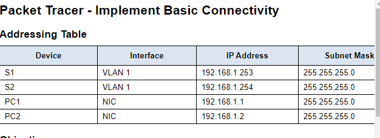
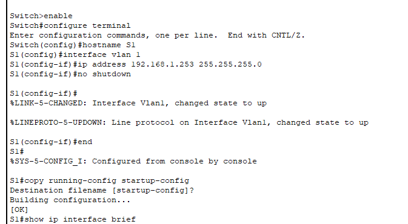
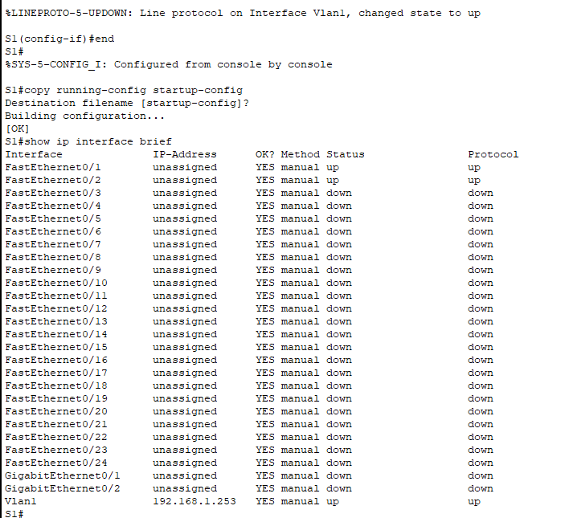
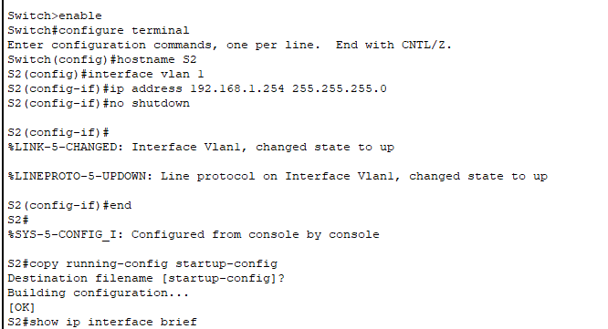
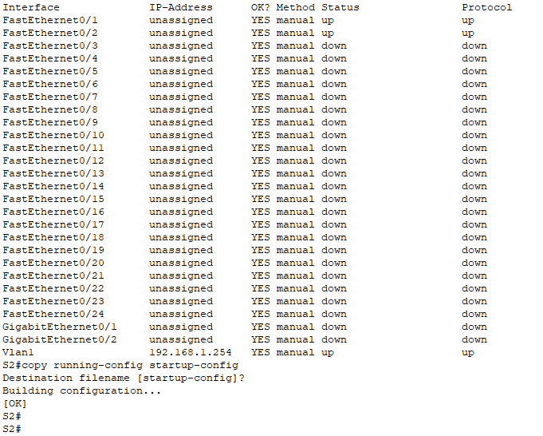
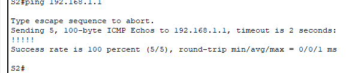

# Basic Switch Configuration    
---------------------------
### Objectives ###
Part 1: Perform a Basic Configuration on S1 and S2
Part 2: Configure the PCs
Part 3: Configure the Switch Management Interface
---------------------------

## Scenario ##
In this activity, you will first perform basic switch configurations. Then you will implement basic connectivity by configuring IP addressing on the switches and PCs. When the IP addressing configuration is complete, you will user various Show commands to verify configurations and use the ping command to verify basic connectivity between devices.

-----------------------------
#  #Implement Basic Connectivity  #

# Perform SVI Configuration on S1 and S2

#   Step 1: Configure S1 with a hostname#  

#Enter the privileged EXEC mode using the "enable" command, to configure the Switch 1 indicated as "S1" on the image previously provided, with the correct IP address indicated on the Address table.

# Step 2: Check connection Status of S1

# Step 3: Configure S2 with a hostname and IP address

#  Step 4:  Check connection status of S2

#  Vertification

#  Step 5: Ping PC1 from S2 to verify the connection is working correctly

-----------------------------------------------------------------------------

## What I Learned

- Initial switch configuration
- Secure device access
- Connectivity verification
- Basic troubleshooting

