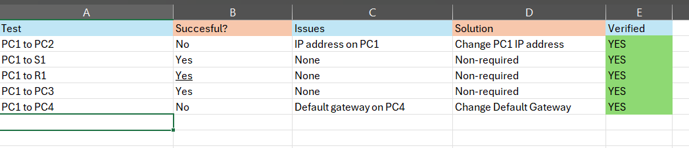
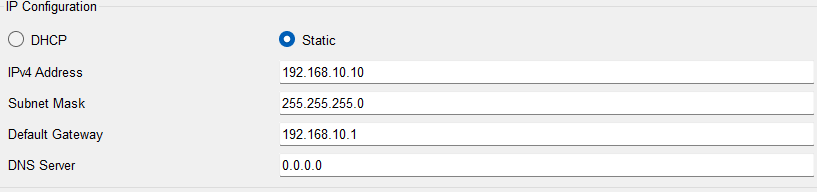
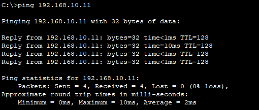

#  Troubleshoot Default Gateway Issues
----------------------------------------------------------

#  Objectives
Part 1: Verify Network Documentation and Isolate Problems
Part 2: Implement, Verify, and Document Solutions.
-----------------------------------------------------------

  #  Resources
-----------------------------------------------------------
Addresses Table

  

Network connections

  
  
------------------------------------------------------------

  #  Background/ Scenario
For a device to communicate accross multiple networks, it must be configured with an IP address, subnet mask, and a default gateway. You will then verify the network documentation by testing en-to-end connectivity and troubleshooting issues.

--------------------------------------------------------------
#  Part 1: Verify Network Documentation and Isolate Problems
  #  Step 1: Verify the network documentation and isolate any problems
In this part I documented multiple connection tests between the devices listed on the Address Table, to ensure every device have the right configuration and is working properly.

I apply the "ping" command multiple times to check the connection from PC1 to the other devices on the network.

  #  Step 2: Determine an appropiate solution to the problem

On this time only the connection from PC1 to PC2 and connection from PC1 to PC4 failed, for PC1 to PC2 the problem was related to a wrong IP address for PC1.
So I update the IP information with the correct IP address according to the Addresses table information. 

  

Also ping PC2 from PC1 to check the connection is now working properly

  

  

  

  

